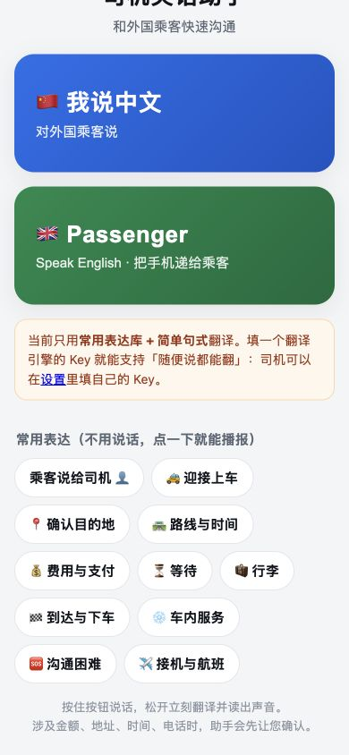

# 司机英语助手

给不会英语的网约车司机用的双向语音沟通工具：司机按住说中文，松手后自动翻译并读出英文给乘客听；把手机递给乘客，乘客按住说英文，同样读中文给司机听。

打开地址：**https://rebecca1017.github.io/driver-lingo/**

手机扫这个码就能打开，也可以把这张图打印出来贴在车里（[qr-share.png](qr-share.png)）：

## 给司机：怎么用

1. 用手机浏览器打开上面的地址（第一次会问“是否允许使用麦克风”，点允许）。
2. 点「🇨🇳 我说中文」→ 按住大按钮说一句中文 → 松手。屏幕上会显示放大的英文，并自动读出来。
3. 涉及金额、地址、时间、电话、航班号时，助手会先显示“我听到的是……”，点「✓ 对」才翻译，防止把 58.6 说成 586。
4. 把手机屏幕转给乘客看，或者点句子下面的「放大给乘客看」。
5. 乘客要说话：点「🇬🇧 Passenger」再把手机递过去即可。
6. 不想说话时，点「常用表达」，选场景，点一句就播报，最快最稳。

### 从微信里点开链接的注意

微信内置的浏览器**不允许网页使用麦克风**，所以在微信里按住说话会没有反应。请点右上角的 **···** → **在浏览器打开**，再允许麦克风。

建议在浏览器里选一次「添加到主屏幕」，以后从桌面图标点开就是全屏的，不用再经过微信。

在微信里也能用：点「常用表达」直接播报，或者进对话页用「打字输入」。

## 给家里人：常见问题

**1. 听不见声音？**
先看手机左侧的静音键和音量，然后点结果卡片上的「🔊 播放」。如果还是没声音，点「🐢 慢速」再试。

**2. 说话没反应？**
确认是在系统浏览器里打开（不是微信里），并且同意过麦克风权限。如果之前点过“不允许”，到浏览器地址栏左侧的设置里重新打开麦克风。

**3. 车上太吵识别不准？**
把手机靠近嘴边说话，或者直接用「常用表达」点句子。

**4. 翻译要花钱吗？**
司机不需要付钱。翻译用的是应用方提供的内置服务，没网的时候会自动改用手机本地的常用表达库。

## 给维护者：部署与修改

纯静态网页，没有任何构建步骤。

- 部署：GitHub Pages，Source 选 `main` 分支根目录即可。
- 更新内容：改完文件 `git push`，等一两分钟刷新页面就生效（页面有离线缓存，必要时下拉刷新）。
- 改翻译服务：编辑 `config.js` 里的 `apiKey`、`baseUrl`、`model`；把 `enabled` 改成 `false` 可以一次性关掉所有设备的内置翻译。
- 限流：`dailyLimitPerDevice` 控制每台设备每天用内置 Key 翻译多少次，超出后自动回落到离线表达库。

### 关于内置 API Key

`config.js` 里的 Key 会随网页一起发给每个打开链接的人，**拿到链接的人都能看到并使用它**。所以：

- 不要把这个链接公开传播（比如发到群里、贴到公开页面）；
- 在服务商后台设置用量上限和费用提醒；
- 一旦发现费用异常，立刻在后台吊销并换一个 Key，只需要改 `config.js` 一行，然后 `git push`。
- 长期方案是加一层服务端代理，让前端不再保存 Key（见 PRD 第 17.5 节）。

## 文件说明

| 文件 | 作用 |
| --- | --- |
| `index.html` | 界面与交互，单页应用 |
| `config.js` | 内置翻译服务的开关、接口地址、Key、每日限额 |
| `logic.js` | 常用表达库、关键信息识别、数字校验、翻译提示词 |
| `sw.js` `manifest.webmanifest` | 离线缓存、添加到手机主屏幕 |
| `preview/` | 各页面截图 |

## 能力与限制

- 常用表达覆盖 10 个场景 58 句（迎接上车、确认目的地、路线与时间、费用与支付、等待、行李、到达与下车、车内服务、沟通困难、接机与航班），乘客端另有 16 句。
- 语音识别和播报依赖浏览器：iOS 需要 Safari 14.5 以上，安卓建议用 Chrome；微信内置浏览器不支持。
- 识别出的文字会送到翻译服务（DeepSeek）翻译，语音识别的音频由浏览器厂商处理；不保存录音，不上传通讯录和位置。
- 对话记录只保存在本次页面里，关掉页面就没了。
